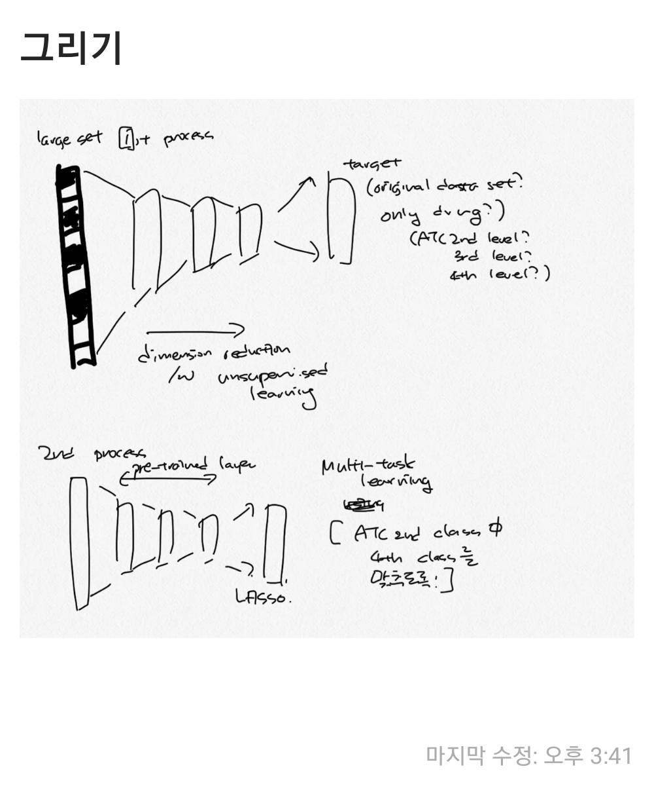

# 2020.07.24 (Fri).

- Reviewing papers about multi-task learning
    - @ruder_overview_2017
    - @ramsundar_massively_2015
    - @bengio_meta-transfer_2019

- Pharmacoepidemiology study 에서 active comparator를 사용한 new-user cohort design에서 propensity score 라는 것은 결국 비슷한 condition을 가진 사람들에서 treatment를 선택하는 환자들의 특성을 예측하는 점수가 됨. ATC 2nd는 약물의 indication을 나타내기 때문에, 같은 ATC 2nd 에 해당하는 약물을 사용한 사람들 중, 4th class를 맞추는 문제를 통해서 deep learning 학습이 가능할 수 있음. 

- Drawing Deep learning model

```{r, fig.cap = "deep learning model architecture", fig.align = "center", echo = F}
#library(knitr)

```


