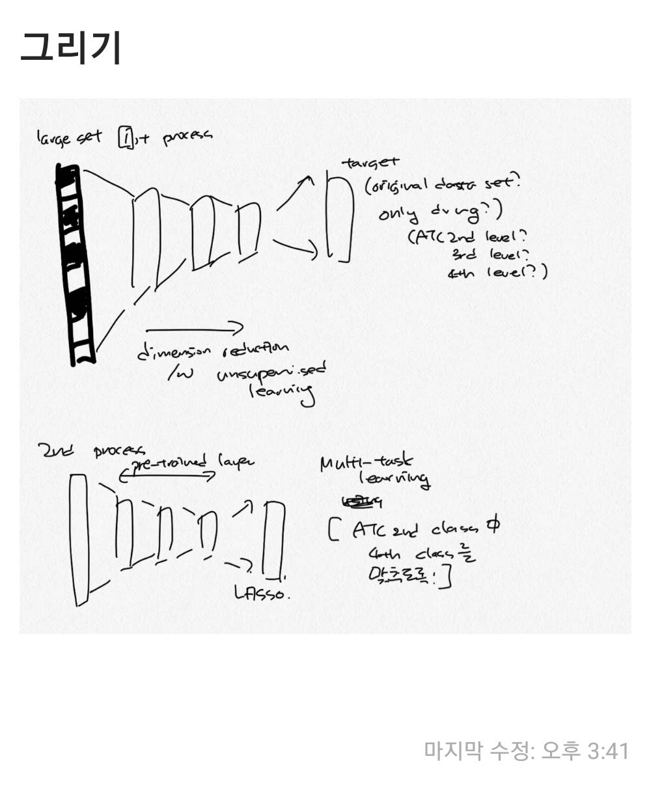

Daily progress for my PhD thesis
================
Seng Chan You
First version: July 24, 2020
This version: July 24, 2020

-   [2020.07.24 (Fri).](#fri.)

2020.07.24 (Fri).
=================

-   Reviewing papers about multi-task learning
    -   Ruder ([2017](#ref-ruder_overview_2017))
    -   Ramsundar et al. ([2015](#ref-ramsundar_massively_2015))
    -   Bengio et al. ([2019](#ref-bengio_meta-transfer_2019))
-   Pharmacoepidemiology study 에서 active comparator를 사용한 new-user cohort design에서 propensity score 라는 것은 결국 비슷한 condition을 가진 사람들에서 treatment를 선택하는 환자들의 특성을 예측하는 점수가 됨. ATC 2nd는 약물의 indication을 나타내기 때문에, 같은 ATC 2nd 에 해당하는 약물을 사용한 사람들 중, 4th class를 맞추는 문제를 통해서 deep learning 학습이 가능할 수 있음.

-   Drawing Deep learning model


<p class="caption">
Fig. deep learning model architecture
</p>

-   Creating cohort based on drug\_era
    -   Identifying new user of drug with 30-day washout period among those who have at least 30-day prior observation period : 29,030,141 rows
    -   Classification of drug\_concept\_ids using ATC 2nd and ATC 4th code: 2nd code 기준으로는 10,000건, 4th code 기준으로는 1,000건 미만인 cell 들은 무시해야될 수; ATC 2nd code 내의 distribution 을 cross-entropy 등을 기준으로 entropy가 너무 낮은 경우 무시하거나, 또는 entropy와 predicting accuracy의 관련성도 살펴볼 수 있음
    -   ATC 2nd 를 동시에 2개 이상 사용한 사람들은 무시되어야 함.

``` r
# Create cohort table and mother cohort
connection <- DatabaseConnector::connect(connectionDetails)

# Create study cohort table structure:
sql <- SqlRender::readSql("./inst/sql/sql_server/CreateCohortTable.sql")
sql <- SqlRender::render(sql,
                         cohort_database_schema = cohortDatabaseSchema,
                         cohort_table = cohortTable)
sql <- SqlRender::translate(sql,
                            targetDialect = attr(connection, "dbms"))
DatabaseConnector::executeSql(connection, sql, progressBar = FALSE, reportOverallTime = FALSE)

# Insert base cohort into the cohort table
sql <- SqlRender::readSql("./inst/sql/sql_server/base_cohort.sql")
sql <- SqlRender::render(sql,
                         cdm_database_schema = cdmDatabaseSchema,
                         cohort_database_schema = cohortDatabaseSchema,
                         cohort_table = cohortTable,
                         cohort_definition_id = 1,
                         minimum_prior_observation = 7)
sql <- SqlRender::translate(sql,
                            targetDialect = attr(connection, "dbms"))
DatabaseConnector::executeSql(connection, sql, progressBar = FALSE, reportOverallTime = FALSE)

# Disconnect
DatabaseConnector::disconnect(connection)
```

Bengio, Yoshua, Tristan Deleu, Nasim Rahaman, Rosemary Ke, Sébastien Lachapelle, Olexa Bilaniuk, Anirudh Goyal, and Christopher Pal. 2019. “A Meta-Transfer Objective for Learning to Disentangle Causal Mechanisms.” *arXiv:1901.10912 \[Cs, Stat\]*.

Ramsundar, Bharath, Steven Kearnes, Patrick Riley, Dale Webster, David Konerding, and Vijay Pande. 2015. “Massively Multitask Networks for Drug Discovery.” *arXiv:1502.02072 \[Cs, Stat\]*.

Ruder, Sebastian. 2017. “An Overview of Multi-Task Learning in Deep Neural Networks.”
